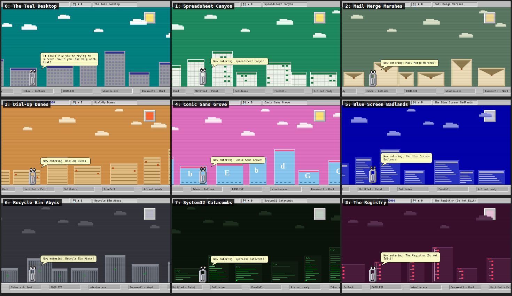

# 📎 CLIPPY.EXE — The Office Assistant Strikes Back

An epic 90s-Windows side-scroller starring the one and only Clippy, rendered
with hand-placed pixel art and running inside a fully chromed Windows 95
window — teal desktop, Start button, tray clock and all.


## Play it

Zero dependencies, zero build step. Just open the file:

```
open index.html          # macOS
xdg-open index.html      # Linux
start index.html         # Windows
```

Or serve it if you prefer: `npx serve .`

## The game

It is 1997. Clippy hops endlessly across a desktop metropolis of window-pane
skyscrapers, along a ground made of infinite taskbar. The OS itself is out to
get him.


- **Jump** over `Error` dialogs, recycle bins, and Blue-Screen monoliths
- **Double-jump** (with a full 360° paperclip spin) to clear stacked crash dialogs
- **Duck** under garish blinking banner ads (*FREE RAM!!! >> CLICK HERE <<*)
- **Dodge** winged hourglass cursors — time flies
- **Collect** 3.5" floppy disks (25 pts each, 1.44 MB of pure skill)
- **Survive** through nine lands, each with its own sky and architecture that
  crossfade as you cross the border: The Teal Desktop → Spreadsheet Canyon
  (spreadsheet towers) → Mail Merge Marshes (envelope blocks) → Dial-Up Dunes
  (sandstone strata at sunset) → Comic Sans Grove (letter blocks, bubblegum sky)
  → The Blue Screen Badlands (gibberish monoliths) → Recycle Bin Abyss →
  System32 Catacombs (DOS towers, blinking cursors) → The Registry (Do Not Edit)



### Power-ups

| Pickup | Effect |
| --- | --- |
| 💿 **Rainbow CD-ROM** | *UNREGISTERED HYPERCLIP MODE* — 6 seconds of invincibility; smash windows into flying UI shards |
| ☕ **Coffee** | 2× points for 9 seconds. Clippy gets the caffeine shakes |
| 🥇 **Golden Floppy** | Autosave — one free death. On impact: *"Document recovered from autosave. Phew!"* |
| 📠 **56K Modem** | Dial-up slow-motion for 6 seconds, screech included. The world now loads at 56k |
| 🂡 **Ace of Hearts** | Solitaire smart bomb — every obstacle on screen explodes into bouncing cards, +50 each |
| 🧲 **Defrag Magnet** | Floppy disks within reach fly to you for 8 seconds |
| ✈️ **Airmail** | Clippy rides a letter — hold JUMP mid-air to glide for 7 seconds. *"It looks like you're writing a letter... TO THE SKY!"* |
| 🔍 **View > Zoom 50%** | Clippy shrinks to half size for 8 seconds — tiny hitbox, huge world |
| ☕ **Cup of Tea** | The internal gossip. Cups pay compounding dividends (+50/+100/+150)… but grab a **fourth** and HR is notified: a homing meeting request hunts you for five seconds. Greed is a choice |

Active effects show as beveled tags under the score bar and blink when about
to expire. Effects stack — coffee-doubled card bombs are the path to big scores.

### Bosses

Every 2,500 points (starting at 2,000), the music turns minor and a boss
arrives. They alternate, and both scale up on each return (more HP, faster
attacks). The universal rule: **stomp the top**. HYPER mode lets you ram them;
autosave gives you one free body-check.

**The Evil Twin — `clippy.exe (Not Responding)`.** Clippy's hung-process
doppelgänger: half again his size, ghost-gray, red-eyed, flickering like a
window that gave up in 1997. He hovers at the edge of the screen lobbing
spinning error dialogs, then flashes red, drops to the taskbar, and
**charges** — that's your stomp window.


**START.EXE — The Button That Would Not Stop.** A giant, furious Start button
(*"4% defragged"*) that finished defragmenting and is done waiting. It erupts
full **Start-menu pillars** out of the taskbar (watch the hazard stripes),
slides over your head, and **slams down**, sending shockwaves along the
ground. While it sits there pressed-in and stunned — jump on it. Where do you
want to go today? DOWN.

**TEA.EXE — The Internal Tea (Do Not Forward).** A giant, furious office
teacup — angry eyes, steam, a teabag tag reading *HOT GOSS*. It drifts around
lobbing gossip bubbles (*"fwd: fwd: fwd:"*, *"per my last"*), then tips over
and **spills**: a scalding tea tide surges along the taskbar and leaves
steaming puddles that linger. Empty, it sinks to the ground to re-steep —
that's when you stomp it. *"Steeped! Per my last stomp—"*

Bosses rotate Twin → START → TEA. Defeating any of them detonates a Solitaire
card storm, a floppy shower, and a 500-point bounty.

Clippy provides unsolicited commentary throughout, naturally.
*"It looks like you're trying to survive. Would you like help with that?"*

When you die — and you will — you get the full Blue Screen of Death, with your
score formatted as a fatal exception report.


## Controls

| Key | Action |
| --- | --- |
| `Space` / `↑` / `W` | Jump (press twice to double-jump) |
| `↓` / `S` | Duck (in mid-air: fast-fall) |
| `Enter` | Start / reboot after a crash |
| `P` | Pause |
| `M` | Mute |
| Tap / click | Jump (hold for a higher jump, or to glide with Airmail) |
| Hold the bottom quarter of the screen | Duck — held for as long as your finger is down |

## On your phone

CLIPPY.EXE is mobile-first when it needs to be:

- On phones in **landscape**, the Win95 desktop gets out of the way — the game
  runs edge-to-edge with just a small ⏸ pause chip (tap the game to resume)
- In **portrait** you get a period-accurate Display Settings dialog telling you
  to rotate (*"It looks like you're holding your phone wrong."*)
- It's an installable **PWA**: open the hosted page, "Add to Home Screen," and
  it launches fullscreen with a pixel-Clippy icon and **plays offline** via a
  service worker (HTTPS hosting required — e.g. GitHub Pages)

## 90s features, lovingly recreated

- Fake BIOS boot sequence (`Memory Test: 640K ... OK`) with a chunky loading bar
- Chiptune soundtrack and bleepy sound effects via WebAudio — no audio files
- CRT scanline overlay
- The sun is a beveled gray button, because everything is a widget in 1997
- Scrolling taskbar ground with embedded task buttons (`DOOM.EXE`, `winmine.exe`,
  `A:\ not ready`)
- Working menu bar (`File > New Game`), About dialog, and a Start button that is
  busy defragmenting (estimated time remaining: 14 years)
- High scores persist to `A:\HISCORE.INI` (fine, `localStorage`)

## Credits

Clippy pixel-art body, eye-animation sequences, and signature hop pattern ported
from the original `Clippy.tsx` canvas component. He has been waiting since 1997.
All he ever wanted was to help.
