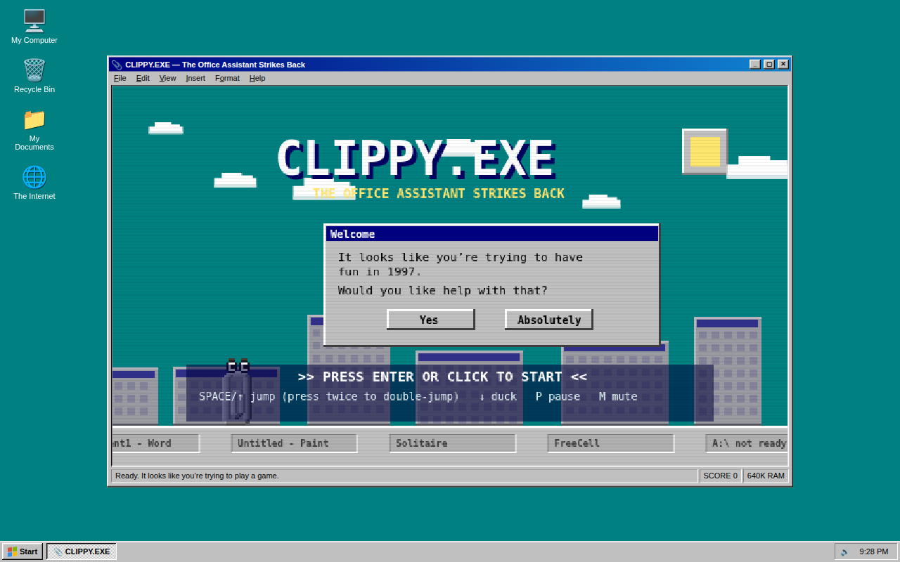
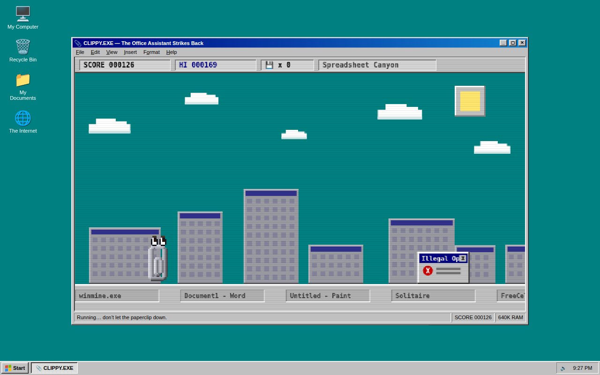
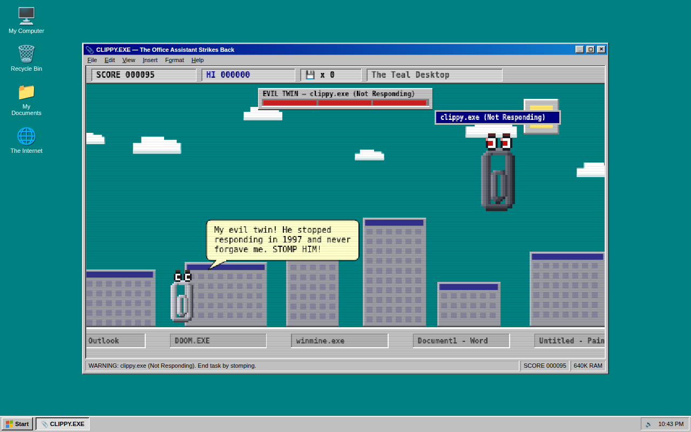
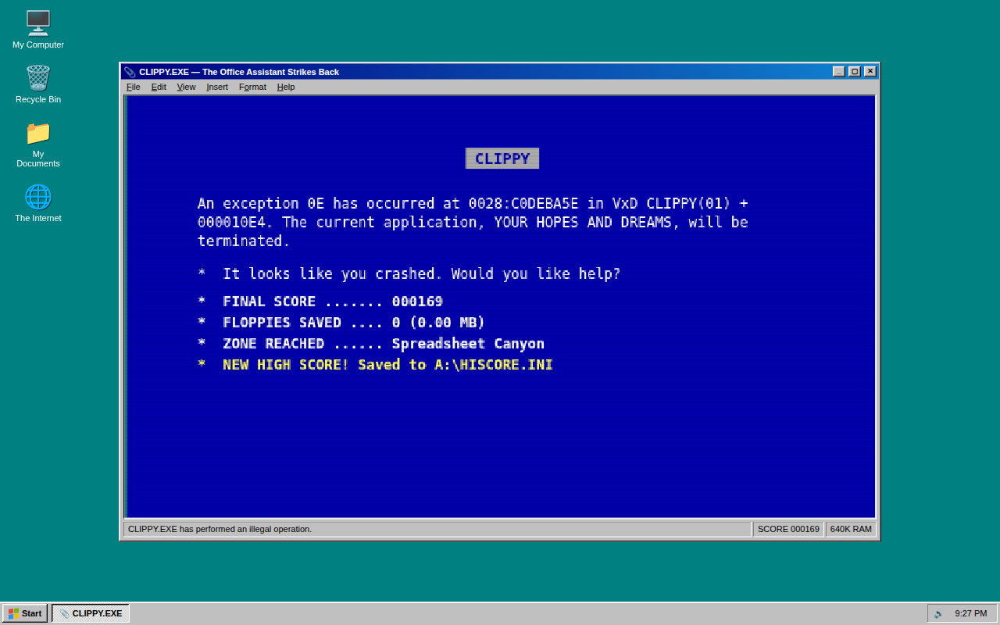

# 📎 CLIPPY.EXE — The Office Assistant Strikes Back

An epic 90s-Windows side-scroller starring the one and only Clippy, rendered
with hand-placed pixel art and running inside a fully chromed Windows 95
window — teal desktop, Start button, tray clock and all.



## Play it

Zero dependencies, zero build step. Just open the file:

```
open index.html          # macOS
xdg-open index.html      # Linux
start index.html         # Windows
```

Or serve it if you prefer: `npx serve .`

## The game

It is 1997. Clippy hops endlessly across a desktop metropolis of window-pane
skyscrapers, along a ground made of infinite taskbar. The OS itself is out to
get him.



- **Jump** over `Error` dialogs, recycle bins, and Blue-Screen monoliths
- **Double-jump** (with a full 360° paperclip spin) to clear stacked crash dialogs
- **Duck** under garish blinking banner ads (*FREE RAM!!! >> CLICK HERE <<*)
- **Dodge** winged hourglass cursors — time flies
- **Collect** 3.5" floppy disks (25 pts each, 1.44 MB of pure skill)
- **Survive** through nine zones: The Teal Desktop → Spreadsheet Canyon →
  Mail Merge Marshes → Dial-Up Dunes → Comic Sans Grove → The Blue Screen
  Badlands → Recycle Bin Abyss → System32 Catacombs → The Registry (Do Not Edit)

### Power-ups

| Pickup | Effect |
| --- | --- |
| 💿 **Rainbow CD-ROM** | *UNREGISTERED HYPERCLIP MODE* — 6 seconds of invincibility; smash windows into flying UI shards |
| ☕ **Coffee** | 2× points for 9 seconds. Clippy gets the caffeine shakes |
| 🥇 **Golden Floppy** | Autosave — one free death. On impact: *"Document recovered from autosave. Phew!"* |
| 📠 **56K Modem** | Dial-up slow-motion for 6 seconds, screech included. The world now loads at 56k |
| 🂡 **Ace of Hearts** | Solitaire smart bomb — every obstacle on screen explodes into bouncing cards, +50 each |
| 🧲 **Defrag Magnet** | Floppy disks within reach fly to you for 8 seconds |
| ✈️ **Airmail** | Clippy rides a letter — hold JUMP mid-air to glide for 7 seconds. *"It looks like you're writing a letter... TO THE SKY!"* |
| 🔍 **View > Zoom 50%** | Clippy shrinks to half size for 8 seconds — tiny hitbox, huge world |

Active effects show as beveled tags under the score bar and blink when about
to expire. Effects stack — coffee-doubled card bombs are the path to big scores.

### Boss: the Evil Twin

At 2,000 points the music turns minor and **`clippy.exe (Not Responding)`**
flies in — Clippy's hung-process doppelgänger: half again his size, ghost-gray,
red-eyed, flickering like a window that gave up in 1997.



He hovers at the edge of the screen lobbing spinning error dialogs, then flashes
red, drops to the taskbar, and **charges**. That's your opening: **stomp his
head** for 150 points and a bounce. Three stomps ends the task — he detonates
into a Solitaire card storm, showers you with floppies, and pays a 500-point
bounty. He respawns every 2,500 points after that, tougher each time (more HP,
faster throws, meaner charges). HYPER mode lets you ram him; autosave gives you
one free clip-to-clip collision.

Clippy provides unsolicited commentary throughout, naturally.
*"It looks like you're trying to survive. Would you like help with that?"*

When you die — and you will — you get the full Blue Screen of Death, with your
score formatted as a fatal exception report.



## Controls

| Key | Action |
| --- | --- |
| `Space` / `↑` / `W` | Jump (press twice to double-jump) |
| `↓` / `S` | Duck (in mid-air: fast-fall) |
| `Enter` | Start / reboot after a crash |
| `P` | Pause |
| `M` | Mute |
| Click / tap | Jump (tap the bottom of the screen to duck) |

## 90s features, lovingly recreated

- Fake BIOS boot sequence (`Memory Test: 640K ... OK`) with a chunky loading bar
- Chiptune soundtrack and bleepy sound effects via WebAudio — no audio files
- CRT scanline overlay
- The sun is a beveled gray button, because everything is a widget in 1997
- Scrolling taskbar ground with embedded task buttons (`DOOM.EXE`, `winmine.exe`,
  `A:\ not ready`)
- Working menu bar (`File > New Game`), About dialog, and a Start button that is
  busy defragmenting (estimated time remaining: 14 years)
- High scores persist to `A:\HISCORE.INI` (fine, `localStorage`)

## Credits

Clippy pixel-art body, eye-animation sequences, and signature hop pattern ported
from the original `Clippy.tsx` canvas component. He has been waiting since 1997.
All he ever wanted was to help.
